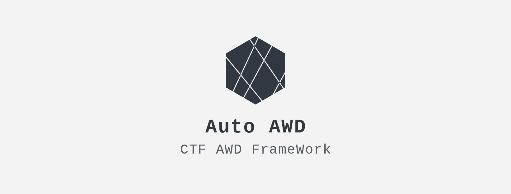

  
  <h3 align="center">Auto AWD</h3>

## About

> Auto-AWD will auto run the payload and submit flag to platform every round

## Demo

## Getting Started

### Prerequisites

- python3
- pip/pipenv

### Installation

Just install python packages: `pipenv install`

## Usage

1. Config your game rules in **config.yml**,like `config.template.yml`

2. `python awd.py`